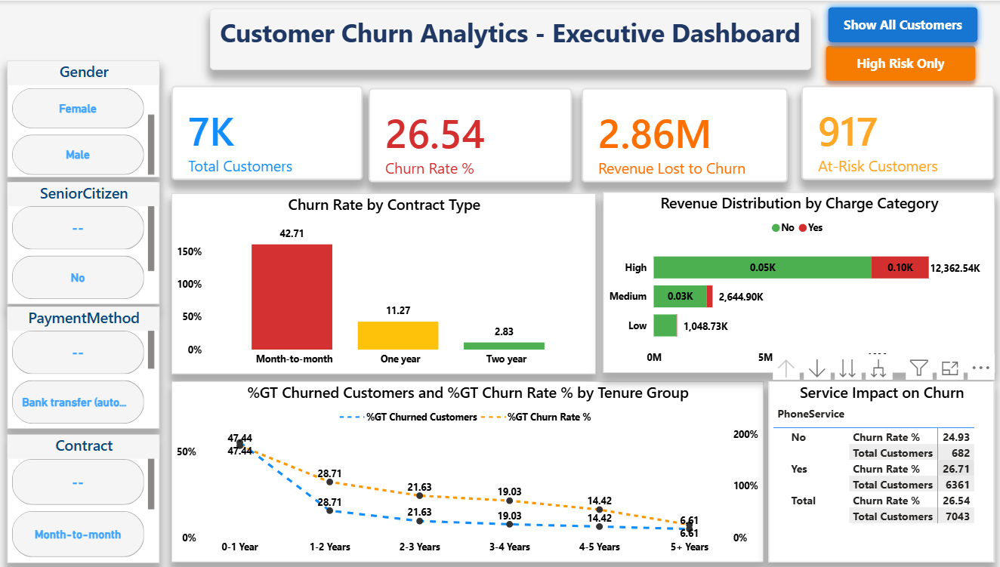
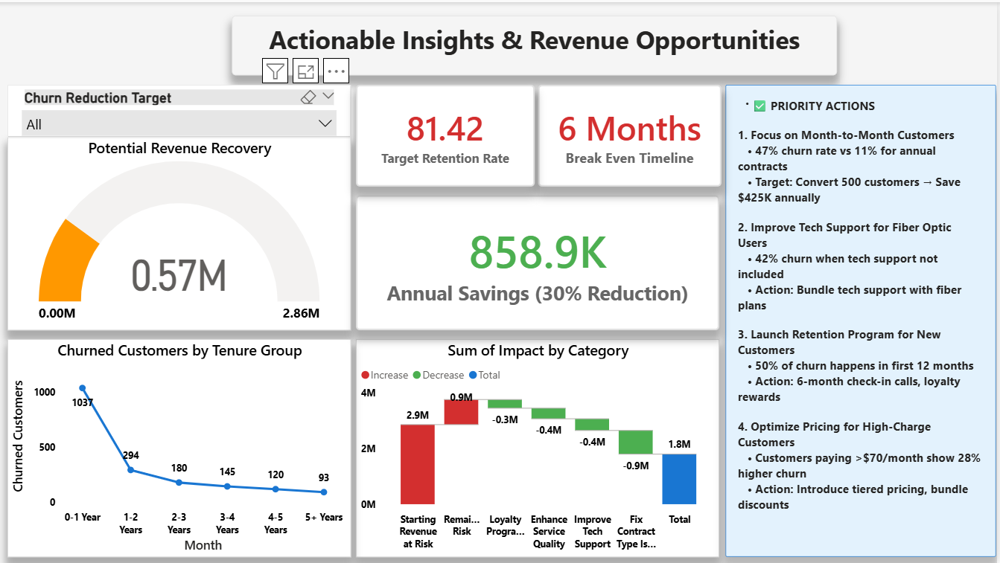

# 📊 Telecom Customer Churn Analysis – Power BI Project  

---

## 🚀 **Project Overview**

The **Telecom Customer Churn Analysis** project focuses on analyzing customer behavior, identifying churn patterns, and deriving actionable insights to improve customer retention.  
Built entirely in **Power BI**, this dashboard leverages **data storytelling**, **DAX measures**, and **interactive visuals** to empower data-driven decision-making.

---

## 🎯 **Objectives**

- Understand **why customers churn** and which segments are most affected.  
- Identify key **KPIs** such as average tenure, monthly charges, and churn rate.  
- Build an **interactive Power BI dashboard** for management insights.  
- Recommend **data-driven retention strategies**.

---

## 🧩 **Dataset Information**

**Source:** `WA_Fn-UseC_-Telco-Customer-Churn.xlsx`  
**Rows:** 7,043 | **Columns:** 21  
**Key Columns:**
- `CustomerID`, `Gender`, `SeniorCitizen`, `Partner`, `Dependents`  
- `Tenure`, `MonthlyCharges`, `TotalCharges`  
- `Contract`, `PaymentMethod`, `InternetService`, `Churn`

---

## 📊 **Dashboard Previews**

| Overview | Demographics | Services |
|-----------|---------------|-----------|
|  |  |  |

---

## 🎥 **Project Demo**

> 🪄 *This demo showcases the interactive filtering, KPI cards, and advanced DAX-based visualizations.*

---

## 🧮 **Key Insights**

- 🔹 Customers on **Month-to-Month contracts** show the **highest churn rate**.  
- 🔹 **Fiber-optic users** tend to churn more than DSL customers.  
- 🔹 **Electronic Check payments** correlate strongly with churn.  
- 🔹 **Longer tenure** → lower churn probability.  
- 🔹 Targeting **mid-tenure users (12–36 months)** with loyalty offers can reduce churn by ≈ 15–20%.

---

## ⚙️ **Technical Stack**

| Tool | Purpose |
|------|----------|
| 🟨 **Power BI** | Dashboard creation, DAX measures, visual storytelling |
| 🧮 **Excel** | Data cleaning, preparation |
| 🧰 **DAX** | Calculated measures and KPIs |
| 🧾 **Git & GitHub** | Version control and project documentation |

---

## 📁 **Folder Structure**

